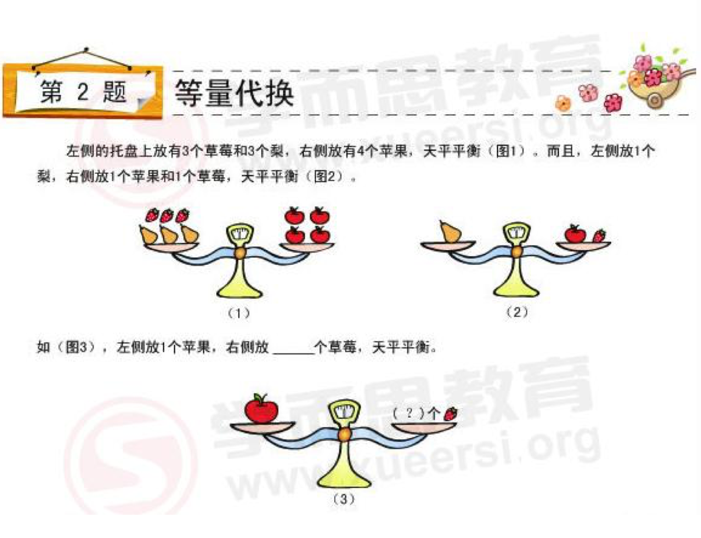
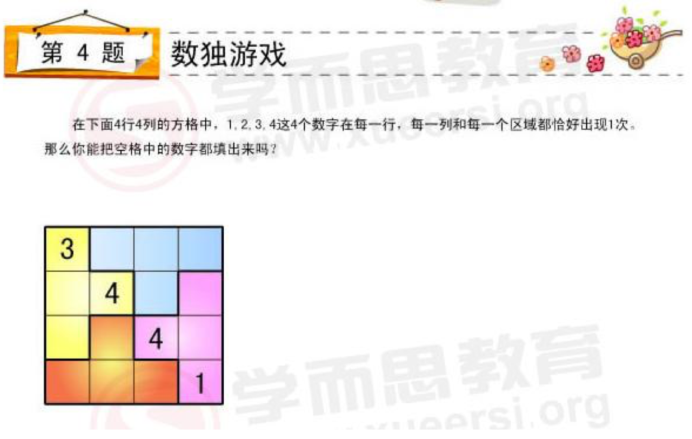
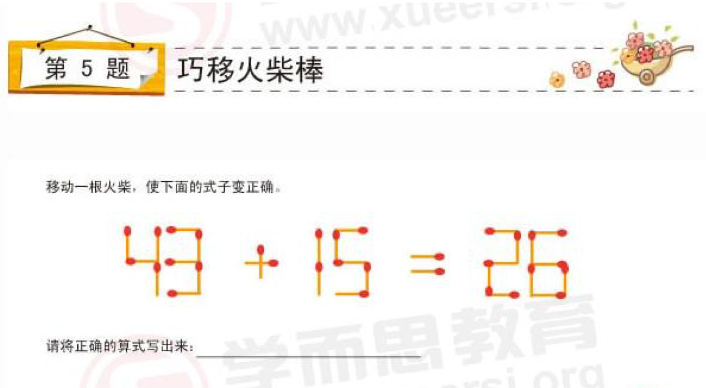
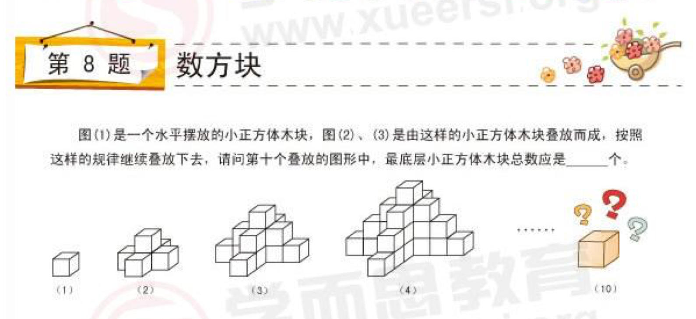
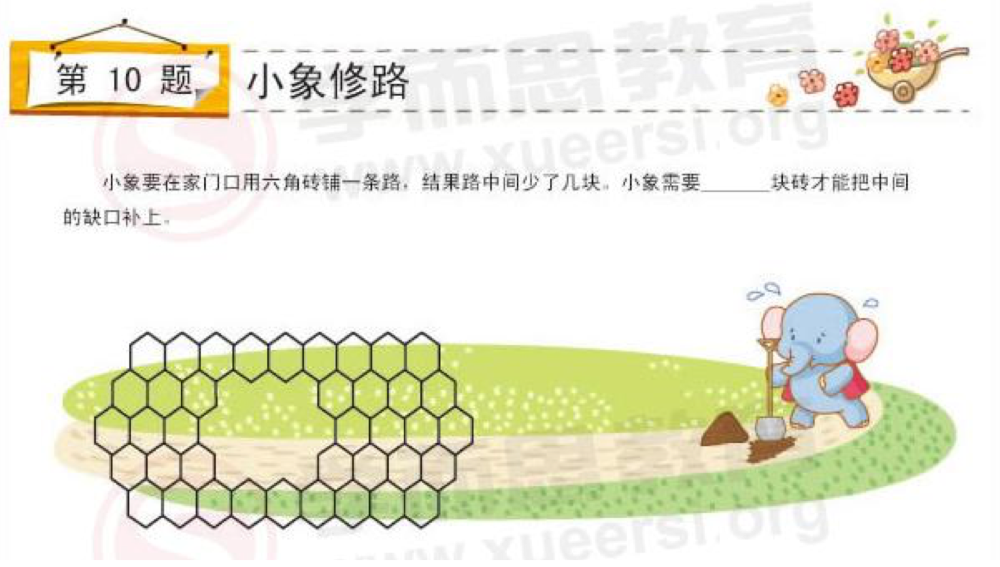
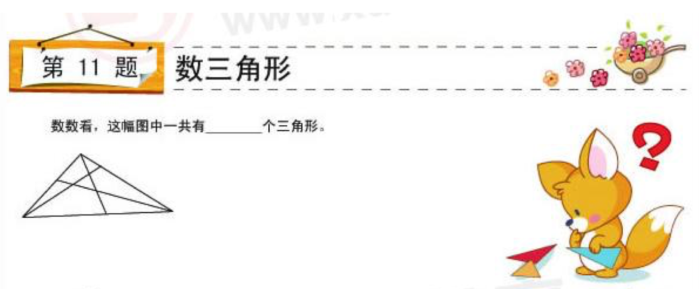
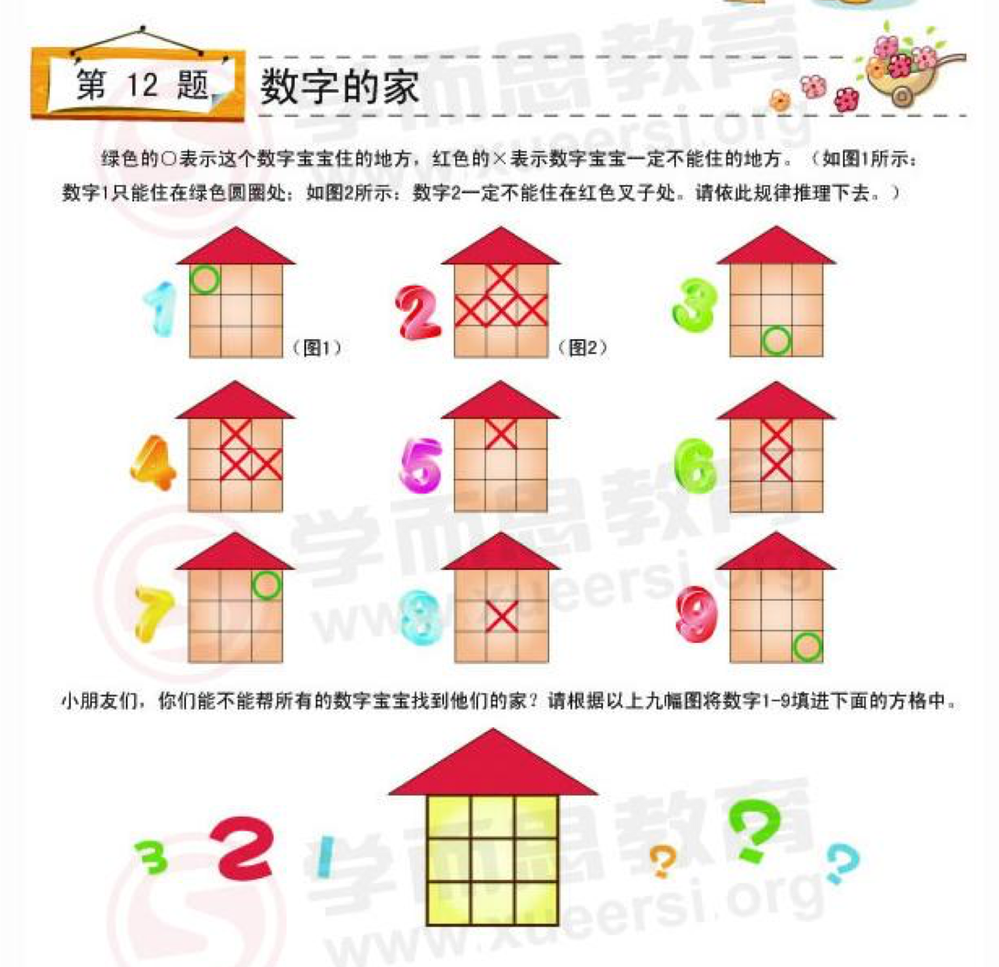

**题目解读**
"数" "学" "花" "园"这四个汉字分别代表 0-3 这四个数字, 相同汉字代表相同数字, 不同汉字代表不同数字.

**思考过程**

1. 等式两边 "花" 字最多, 所以"花"很有可能是 0.
2. 假设"花"是 0, 那等式只有一种可能: *1 + 2 + 0 = 0 + 3*.
3. 所以 园=3.

**另一种思考方式**

对于 0-3 这四个数字来说, 满足上面等式的方式只有 *1 + 2 + 0 = 0 + 3*, 所以 园=3.

--------------------

**题目解读**
由题目可以得知下面两个等式:

- 等式1: 3个🍓 + 3个🍐 = 4个🍎
- 等式2: 1个🍐 = 1个🍎 + 1个🍓

问题: 1个🍎 = 几个🍓 ?

**思考过程**

1. 把等式2代入到等式1里得知新等式: 3个🍓 + 3个苹果+3个🍓 = 4个🍎
2. 合并同项后得知: 6个🍓 = 1个🍎
3. 答案: 1个苹果 = 6个🍓, 左侧放一个🍎右侧放6个🍓, 天平平衡.

**更数学化的思考方式**

设🍐 为 x, 🍓 为 y, 🍎 为 z:
- $3 * x + 3 * y = 4 * z$
- $x = y + z$

由上面两个等式可以推导出: 
$3 * y + 3 * z + 3 * y = 4 * z$
然后:
$6 * y = 1 * z$
即:
1个🍎 = 6个🍓

--------------------

太简单, 直接上答案

- $2 + 4 + 1 = 2 * 4 - 1$
- $2 * 8 - 3 = 2 + 8 + 3$
- $12 / 6 + 2 = 12 - 6 - 2$
- $20 - 10 - 4 = 20 / 10 + 4$
- $4 / 2 + 3 / 1 = 4 * 2 - 3 * 1$

*注: 上面 " / " 代表除号, " * " 代表乘号*

--------------------

**思考过程**

1. 先看黄色区域, 对于第一列来说, 3下面的两个数有可能是1和2, 也有可能是2和1, 所以可以确定的是第一列第四行的数字是4.
2. 同理, 观察紫色区域, 可以得出第四列第一行也是4.

3 _ _ 4
_ 4 _ _
_ _ 4 _
4 _ _ 1

3. 蓝色区域在第四列第一行确定了4后, 同样也可以确定第二行第三列是3
4. 红色区域在第一列第四行确定了4后, 同样也可以确定第二列第三行是1, 因为第四行有个1.

3 _ _ 4
_ 4 3 _
_ 1 4 _
4 _ _ 1

5. 观察第一行, 剩下的两个位置只有可能是1和2, 因为第二列有1, 所以第一行只能是3 2 1 4
6. 观察第一列, 剩下的两个位置只有可能是1和2, 因为第三行有1, 所以第一列只能是 3 1 2 4

3 2 1 4
1 4 3 _
2 1 4 _
4 _ _ 1

7. 观察第二行缺少的唯一一个位置只能是2
8. 观察第三行缺少的唯一一个位置只能是3
9. 观察第二列缺少的唯一一个位置只能是3
10. 观察第三列缺少的唯一一个位置只能是2

3 2 1 4
1 4 3 2
2 1 4 3
4 3 2 1

*注意, 有一种思路是第一步先根据同一颜色里可能的值去往下一步步的试, 虽然最终在错了几次之后可能得出正确答案, 但这是一种错误的方法, 是错误的思考思路.*

--------------------

**思考过程**

1. 观察等式两边 $43 + 15 = 26$, 左边两个相对大的数相加得出了个相对小的数, 所以应该先尝试把加号改成减号.
2. $43 - 15 = 28$, 所以把加号的一根火柴移到等式右边的6上变成8, 等式成立.

--------------------

**思考过程**

1. 一根树干锯成4段, 需要锯3次, 一共耗时12分钟, 所以每锯一次需要4分钟.
2. 接下来4段木头每段木头再锯一次锯成两段, 还需要锯4次, 总共需要4个4分钟, 一共是16分钟.

答案: 还需要16分钟.

--------------------

**思考过程**

1. 40个小朋友一二三报数, 总共可以报 *13* 组, 因为 *3 x 13 = 39*.
2. 报数到第 *13* 组之后, 还可以报一个 *1*, 然后刚刚好 *40* 个小朋友全部报完.

答案: 队里还剩下 $13 + 1 = 14$ 个人.

--------------------

**思考过程**

1. 图(1)是1块, 图(2)比图(1)多一层多4块.
2. 图(3)比图(2)多一层多4块.
3. 图(4)比图(3)多一层多4块.

可得出结论, 每增加一层, 最底层小正方体木块的数量, 会比前一组多4块, 由此可以得出, 第十个地方的图形中底层小正方体木块总数是37个.

由此题扩展出关于数学公式的问题:
设当前堆叠到第 n 组, 求第 n 组最底层小正方体木块的数量?

答案:
以第一组为基准, 可以通过数学公式: $1 + (n - 1) * 4$ 得出答案.

例如:
问第三十个叠放图形中最底层小正方体总数?
只需把 $n = 30$ 代入到上述数学公式中即可得出答案.

--------------------

**思考过程**

1. 先看一下本题的示例, 示例中嘴边图形数田字格总共是 *10* 个田字格, 如果需要分割成完全相同的两部分, 则需要一边5个.
2. 观察问题里的图形, 数田字格, 也是总共 *10* 个田字格, 很容易判断出分割线的画法: 从中线开始往下一个田字格再往右一个田字格再往下一个田字格, 这样可以保证一边 *5* 个田字格.

**答案**
从中线开始往下一个田字格再往右一个田字格再往下一个田字格.

--------------------

**思考过程A**

1. 数中间缺少的部分, 第一排缺3第二排缺4第三排缺3, 总共10块.

**思考过程B**

1. 仔细观察图中缺少的部分, 和其右侧的形状一样, 所以看其右侧部分总共有几块砖即可.

答案: 需要 *10* 块.

--------------------

**思考过程**

1. 先数单个的最小的.
2. 再数两块图形组成一个三角形的.
3. 再数大的.

答案: 13 个.

--------------------

**思考过程**

1. 先依次观察每幅图, 找到数字可以住的地方, 标注出来:

| 1 _ 7
| _ _ _
| _ 3 9

2. 再从图(2)开始观察, 发现数字2只能住在最左下角的位置:

| 1 _ 7
| _ _ _
| 2 3 9

3. 继续观察图(4), 发现数字4只能住在:

| 1 _ 7
| 4 _ _
| 2 3 9

4. 继续观察图(5), 发现数字5可能住在第2排第2和3的位置, 因为数字5的不确定, 所以继续观察图(6), 得出数字6只能住在:

| 1 _ 7
| 4 _ 6
| 2 3 9

5. 观察图(8), 得出数字8只能住在:

| 1 8 7
| 4 - 6
| 2 3 9

6. 最后数字5:

| 1 8 7
| 4 5 6
| 2 3 9

答案:
| 1 8 7
| 4 5 6
| 2 3 9

--------------------