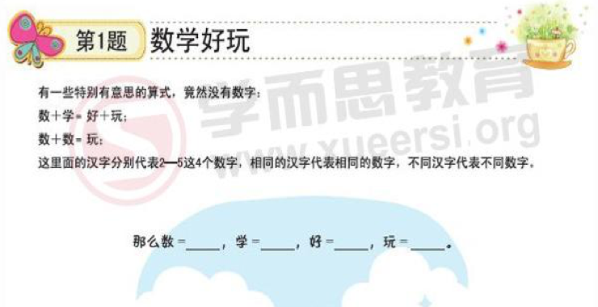
**题目解读**
"数" "学" "好" "玩"这四个汉字分别代表 2-5 这四个数字, 相同汉字代表相同数字, 不同汉字代表不同数字.

**思考过程**

题目给出了两个等式:

(等式1) 数 + 学 = 好 + 玩
(等式2) 数 + 数 = 玩

结合 2 到 5 这 4 个数字:
由等式1可以推出: $2 + 5 = 3 + 4$ 或者 $3 + 4 = 2 + 5$
由等式2可以推出: $2 + 2 = 4$

所以可以得出:
数 = 2
玩 = 4
学 = 5
好 = 3

--------------------

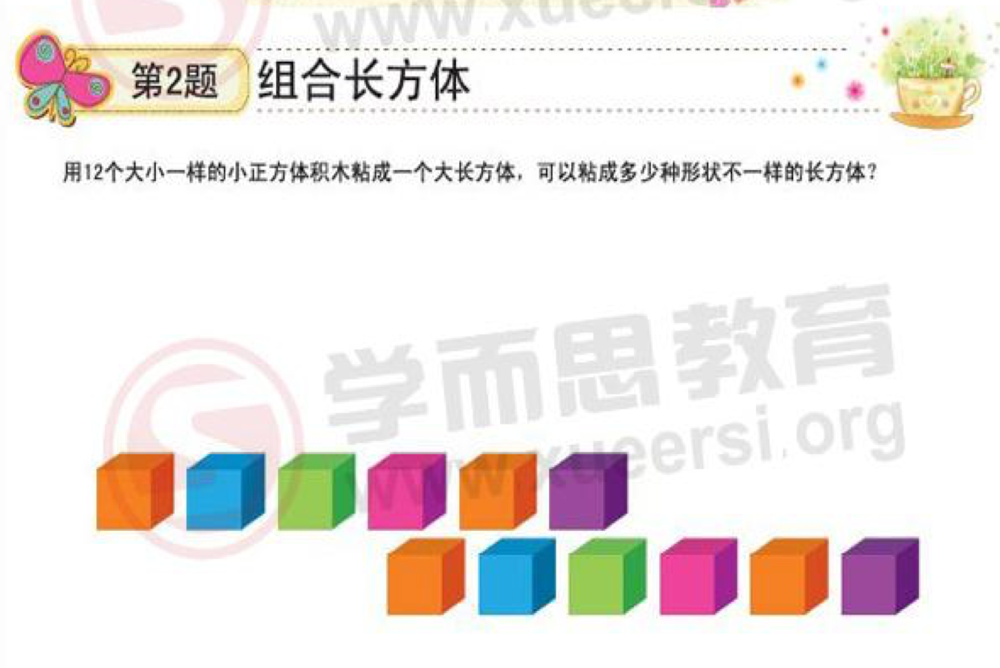

**思考过程**

1. 第一种: 12 个积木排成一长排
2. 第二种: 6个一排排2排
3. 第三种: 4个一排排3排
4. 第四种: 将第二种里的6个一排改为3个一排排2列, 排2排.

**更数学化的思考方式**

这种问题本质是基于乘积为 12 的组合:

1. 第一种: $12 * 1$
2. 第二种: $6 * 2$
3. 第三种: $4 * 3$
4. 第四种: $3 *2 * 2$

答案:
4种

--------------------

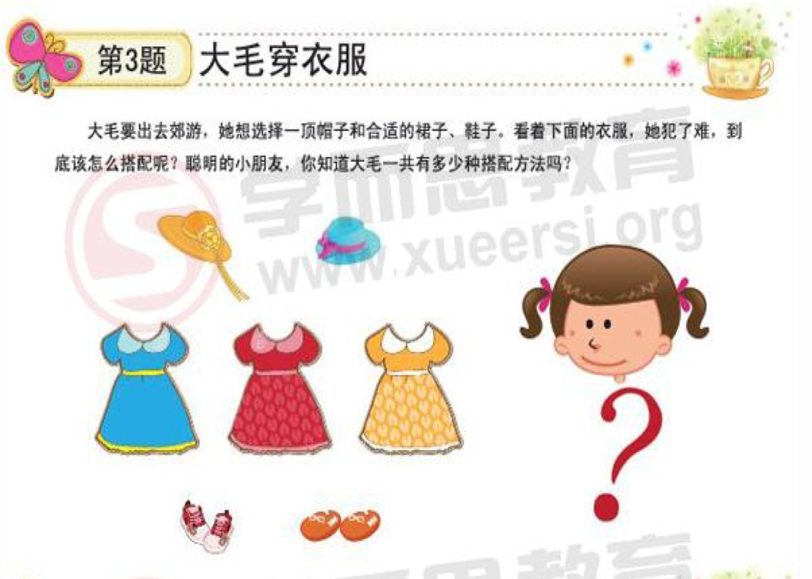

**思考过程**

1. 一顶帽子和三条裙子搭配有三种可能.
2. 这三种每一种搭配两双鞋子共有六钟可能.
3. 对上面的六种搭配里的每一种搭配用第二顶帽子换掉前一个帽子, 这样一共有十二种搭配

**更数学化的思考方式**

1. 两顶帽子 2
2. 三条裙子 3
3. 两双鞋 2

总共有 $2 * 3 * 2 = 12$ 种搭配

**延伸问题**

如果有: 三顶帽子 + 四条裙子 + 五双鞋 那一共有多少种搭配方式? 

--------------------

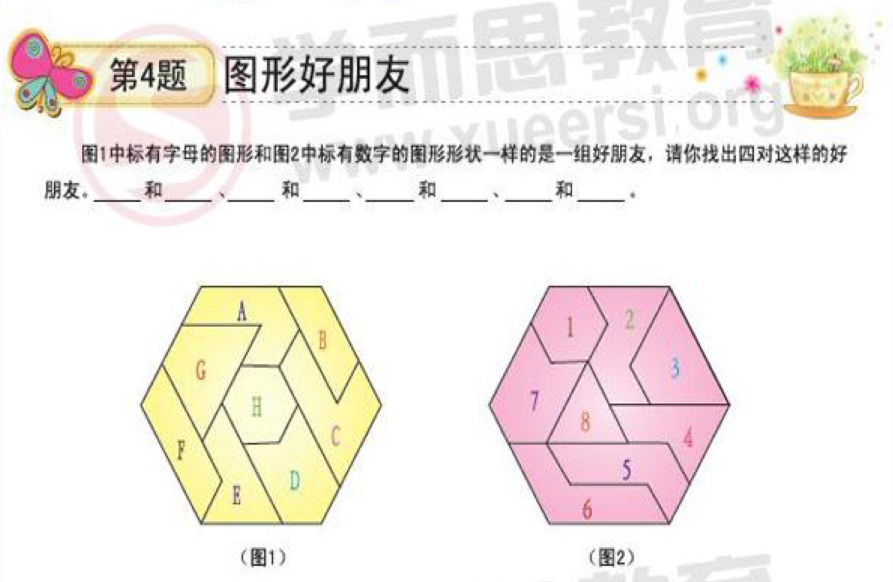

答案:

D - 7
E - 2
G - 3
H - 1

--------------------

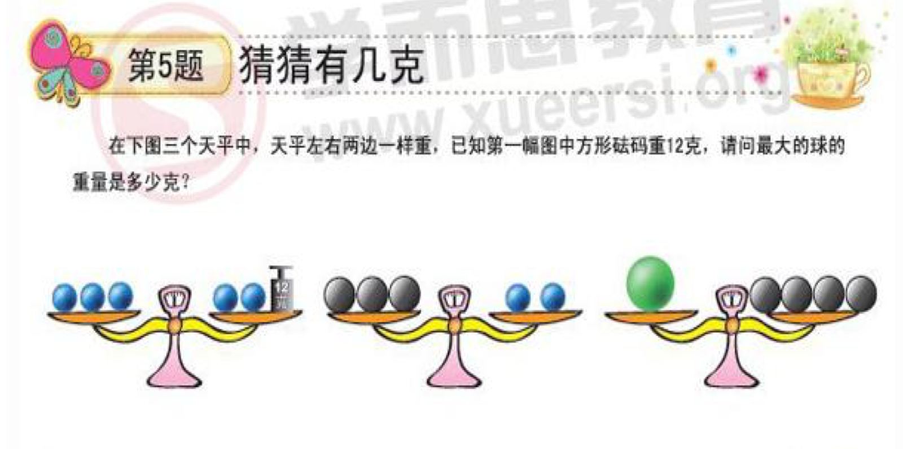

**思考过程**

1. 由天平1得出一个蓝球的重量是12克.
2. 天平2里, 三个黑球的重量和两个蓝球的的重量相等: 
两个蓝球的重量: $2 * 12 = 24$.
所以三个黑球的重量: $3 * 8 = 24$. 一个黑球的重量是 8 克
3. 四个黑球重量等于一个绿球重量, 所以绿球重量等于: $4 * 8 = 32$克

--------------------

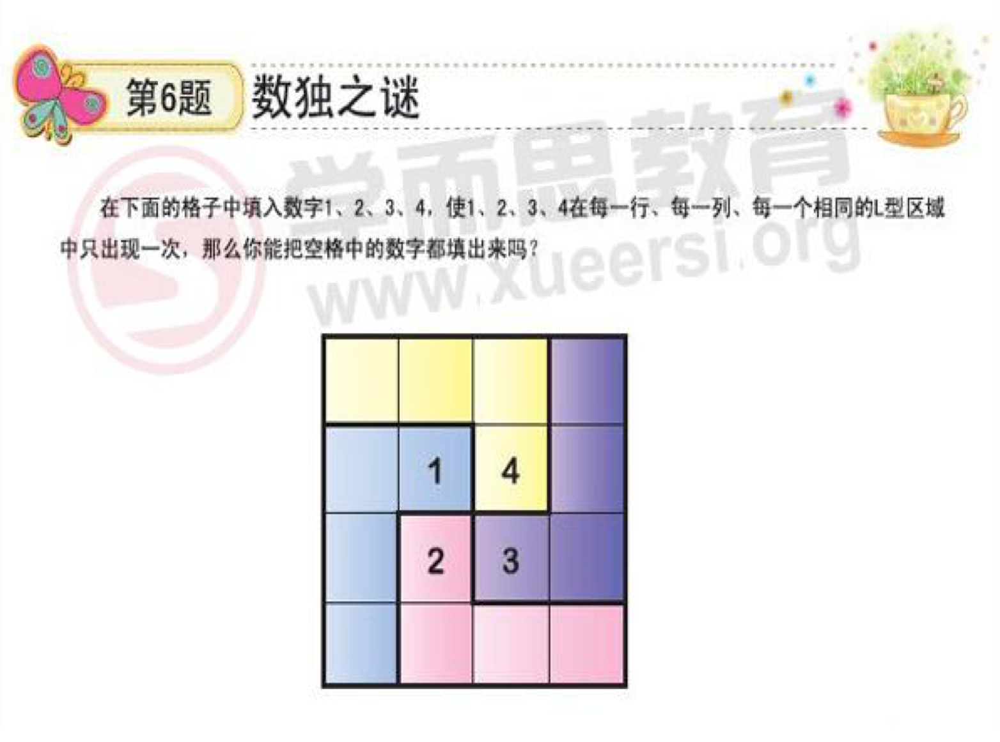

**思考过程**

过程与 2011 年第 4 题一致

**答案**

1 3 2 4
3 1 4 2
4 2 3 1
2 4 1 3

--------------------

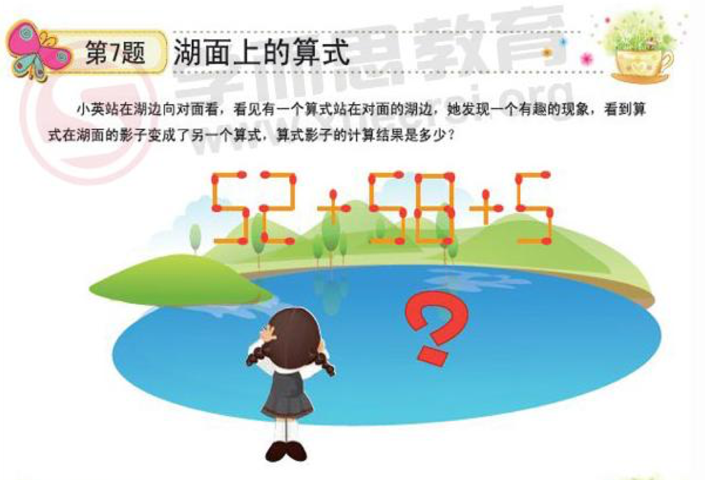

**思考过程**

1. 湖面就像一面镜子, 事物在湖面的倒影看起来都是头脚颠倒的.
2. 5 变 2, 2 变 5, 8 还是 8.
2. 算式 $52 + 58 + 5$ 在湖里的倒影变成了 $25 + 28 + 2 = 55$

答案: 55

--------------------

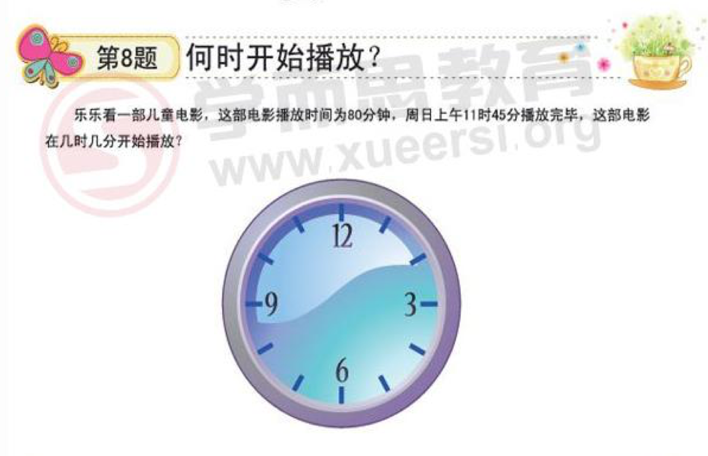

**思考过程**

1. 因为一个小时是 60 分钟, 所以 80 分钟可以分解为: 一个小时(60分钟) + 20分钟.
2. 所以播放时间的计算方式应该是从 *11点45分* 往前推一个小时再推20分钟.
3. 往前推一个小时后时间是 *10点45分*.
4. 再往前推20分钟是 *10点25分*

答案:
电影是从10点25分开始播放的.

--------------------

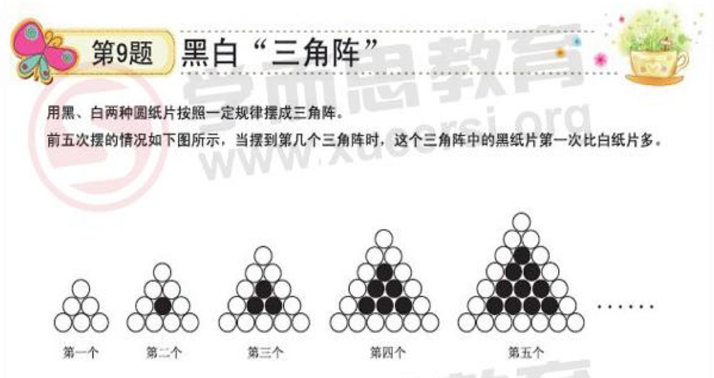

**思考过程**

根据这5个图形找规律:

三角阵:  1  2  _3  _4  _5 _6 _7 _8
黑球数:  0  1  _3  _6  10 15 21 28
白球数:  6  9  12 15 18 21 24 27

**答案**
从第 8 个三角阵开始黑纸片第一次比白纸片多.

--------------------

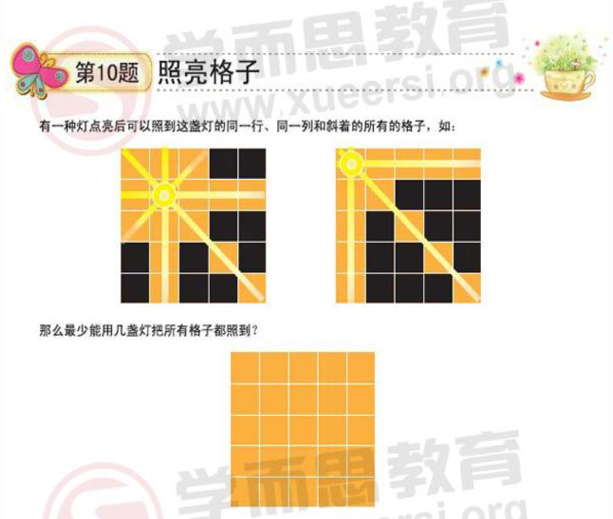

答案: 需要 *3* 盏.

--------------------

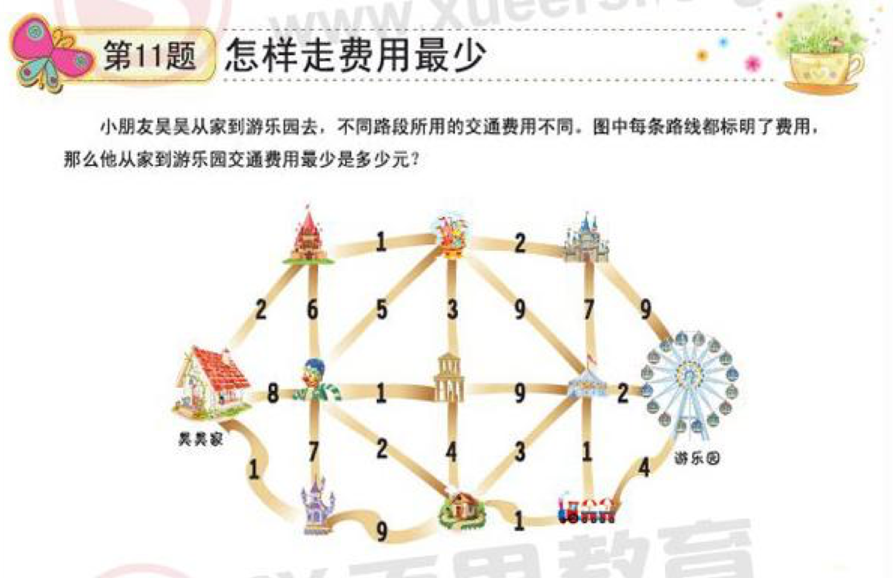

答案: 14 元.

--------------------

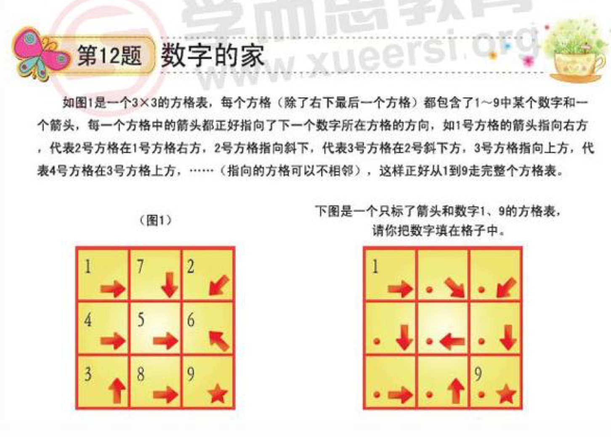

答案:
| 1 7 2
| 4 3 8
| 5 6 9
