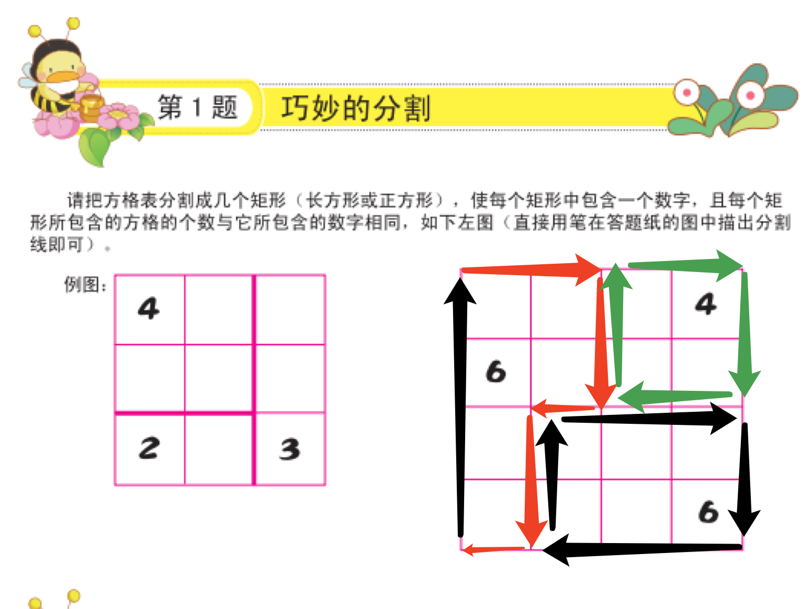

不明白此题的意义是什么, 为了出题而出题?

--------------------

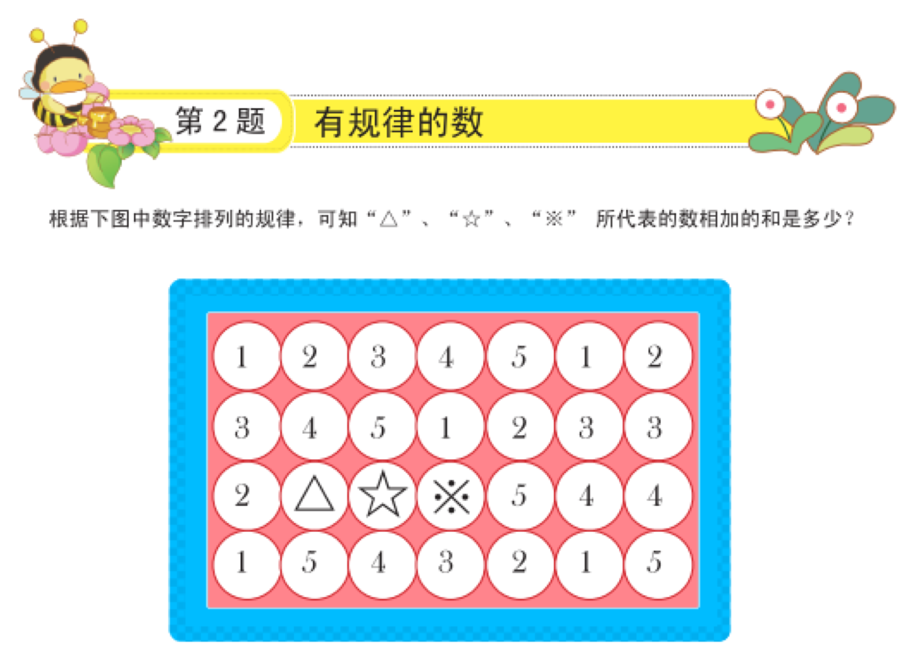

答案: 6

规律如下:

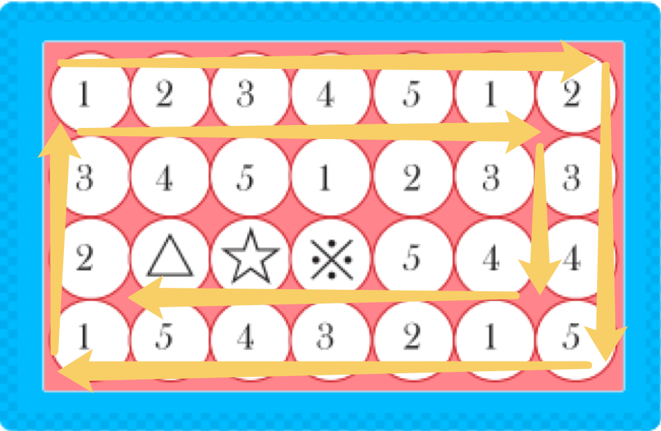

--------------------

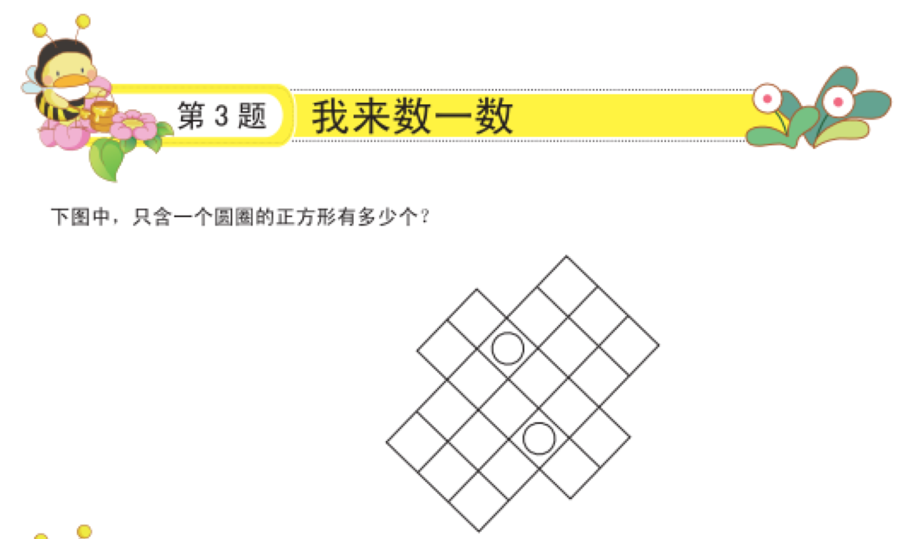

答案:

10个.

--------------------

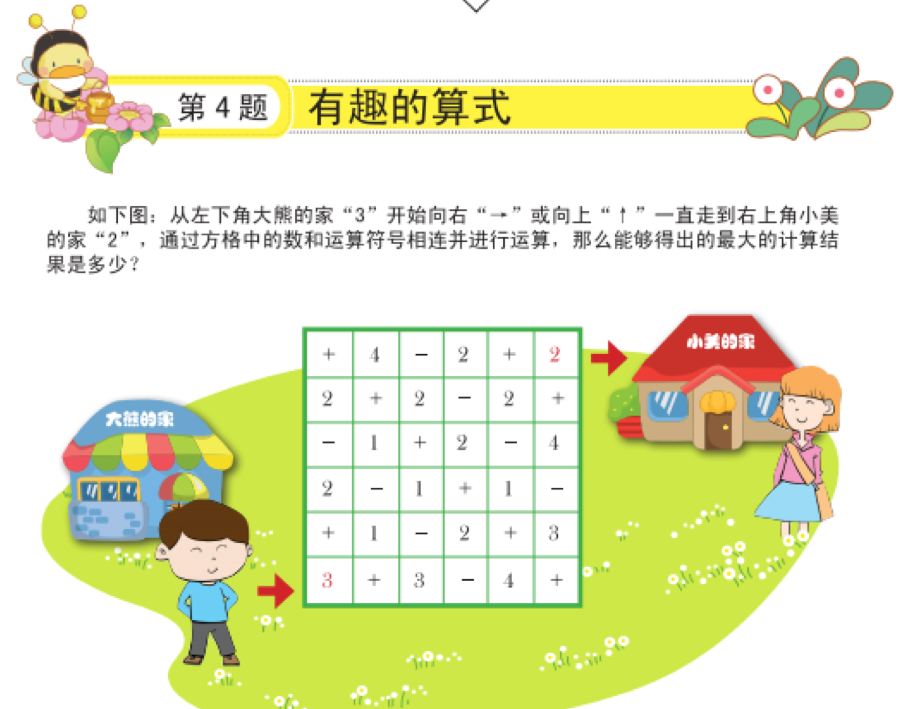

**思考过程**

因为只能向右或是向上, 所以只能一步一步的去尝试.

答案:
8.

--------------------

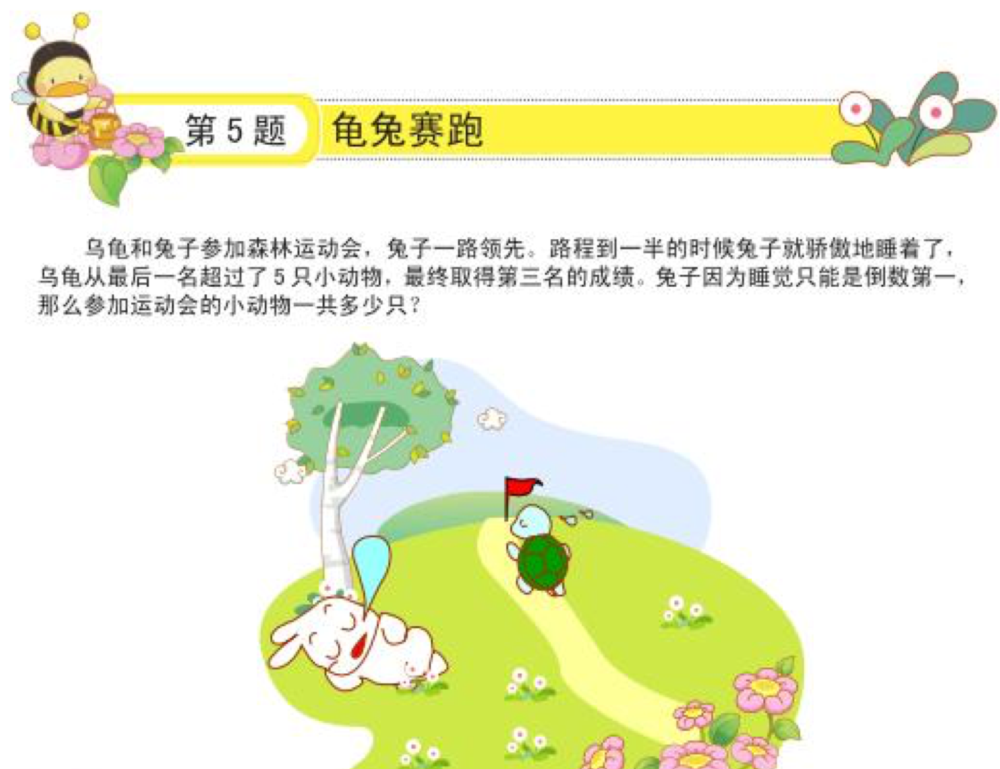

**思考过程**

提取关键信息:

    1. 乌龟从最后一名超过了 5 只小动物, 并且兔子是最后一名, 所以这 5 只包括兔子.
    2. 乌龟取得第三名, 说明前面还有 2 只小动物获得了第一和第二

综上, 答案是:

$ 2 + 1 + 5 = 8$

--------------------

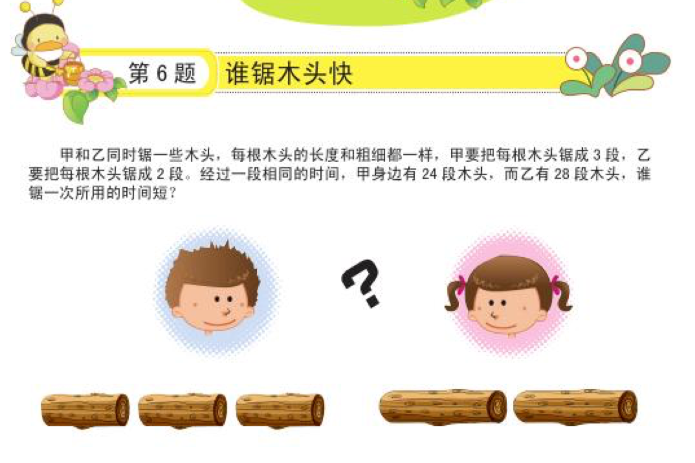

**思考过程**

在相同时间内:
甲: 有 24 段木头, 等于锯了 8 根木头, 每根锯 2 次, 相当于总共锯了 $8 * 2 = 16$ 次.
乙: 有 28 段木头, 等于锯了 14 根木头, 每根锯 1 次, 相当于总共锯了 $14 * 1 = 14$ 次.

**答案**

甲锯一次所用时间短.

--------------------

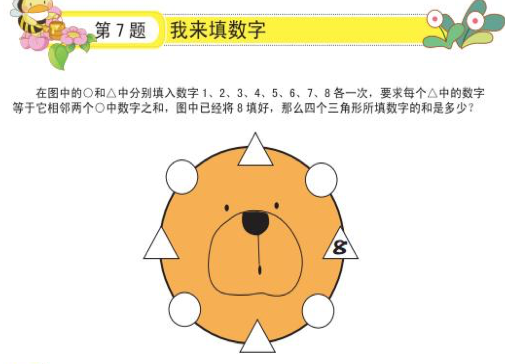

**思考过程**

1. 8 的位置已固定, 在所有两个数加和等于 8 的组合中, 首先排除 $1 + 7$.
2. 从 $2 + 6$ 的组合开始尝试, 对于 2, 有多种可能性: $2 + 1$, $2 + 3$, 所以暂时先从 6 开始考虑.
3. 对于 6, 因为比 6 大的数字只有 7, 所以只有一种可能就是 $6 + 1 = 7$.
4. 这时对于 1 来说, 有两种可能: $1 + 3 = 4$ 和 $1 + 4 = 5$, 回头再看 2, 只有一种可能: $2 + 3 = 5$

答案:
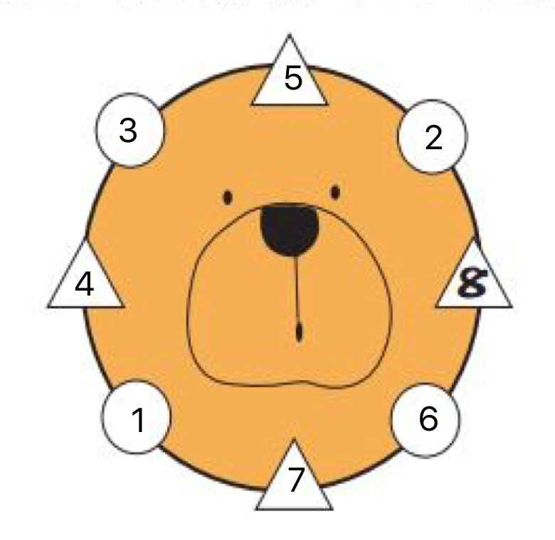

--------------------

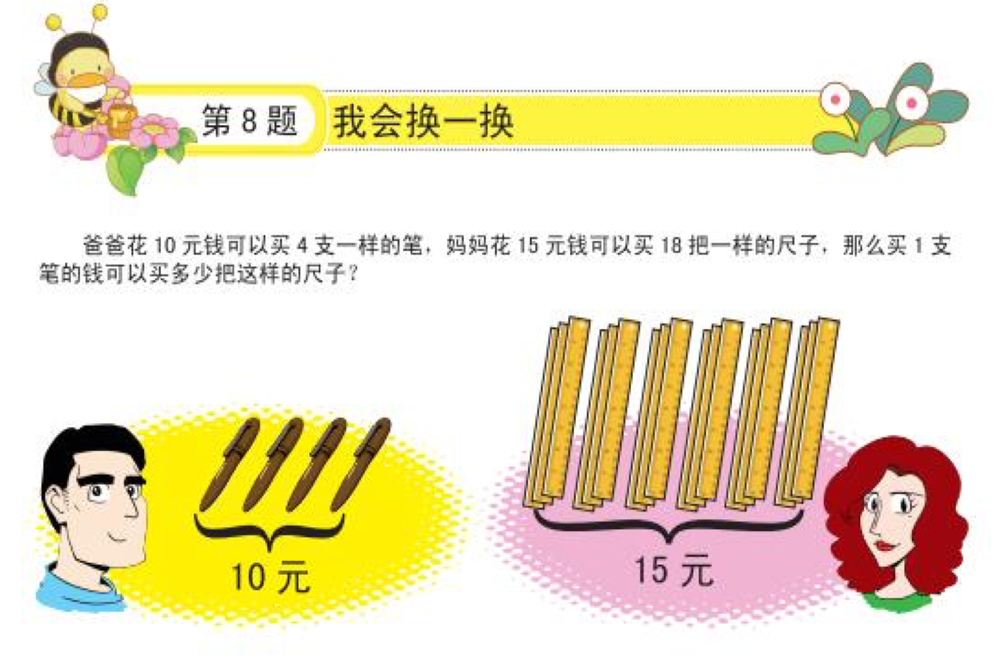

**思考过程**

1. 10 元钱买 4 支笔, 5 元可以买两支.
2. 15 元钱买 18 把尺子, 5 元可以买 6 把尺子.
3. 1 支笔的钱可以买 3 把尺子.

答案:
3 把.

--------------------

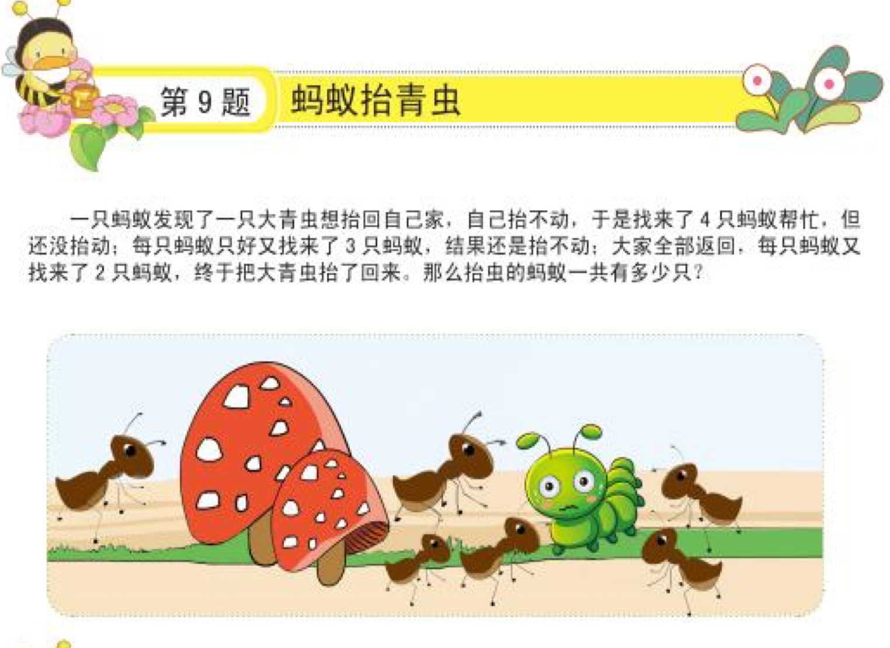

**思考过程**

1. 第一次找来 4 只蚂蚁回来后, 总共有 $1 + 4 = 5$ 只蚂蚁.
2. 第二次每只蚂蚁又找来 3 只, 总共有 $5 + 3 * 5 = 20$ 只.
3. 第三次每只蚂蚁又找来 2 只, 总共有 $20 + 2 * 20 = 60$ 只.

**答案**
60.

--------------------

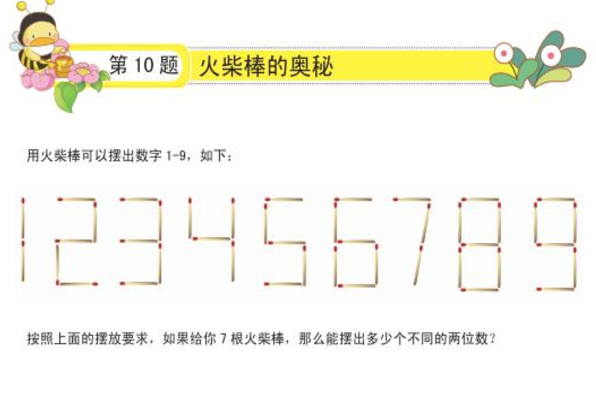

**思考过程**

观察火柴棒组成的 1 - 9 这 9 个数字, 可以得出每个数字由几根火柴棒组成.

    数字:1 2 3 4 5 6 7 8 9
    数量:2 5 5 4 5 6 3 7 6

题目给出 7 根火柴棒, 那就是从数量里找出加和为 7 的两个数字的组合:
12, 47, 21, 74, 13, 31, 15, 51

答案:
8 种

--------------------

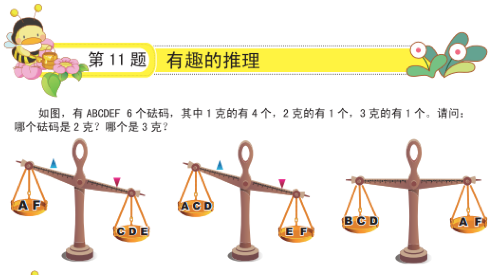

**思考过程**

A B C D E F 6个砝码: 
    
    4 个 1 克的
    1 个 2 克的
    1 个 3 克的

由第一个天平: $A + F < C + D + E$ 可以得出的所有可能性:
    
    1. 1 + 1 < 1 + 1 + 2
    2. 1 + 1 < 1 + 1 + 3
    3. 1 + 2 < 1 + 1 + 3
    得出: A 和 F 是 1 和 2 中的数. B C D E 无法确认.

由第二个天平: $A + C + D < E + F$ 可以得出的所有可能性:

    1. 1 + 1 + 1 < 3 + 2 (当 A 是 1, F 是 2时)
    2. 当 A 是 2, F 是 1 时上式无法成立.
    得出: A = 1, B = 1, C = 1, D = 1, E = 3, F = 2

由第三个天平: $B + C + D = A + F$

    1 + 1 + 1 = 1 + 2
    可以验证上述答案

答案: F 砝码是 2 克, E 砝码是 3 克.

--------------------

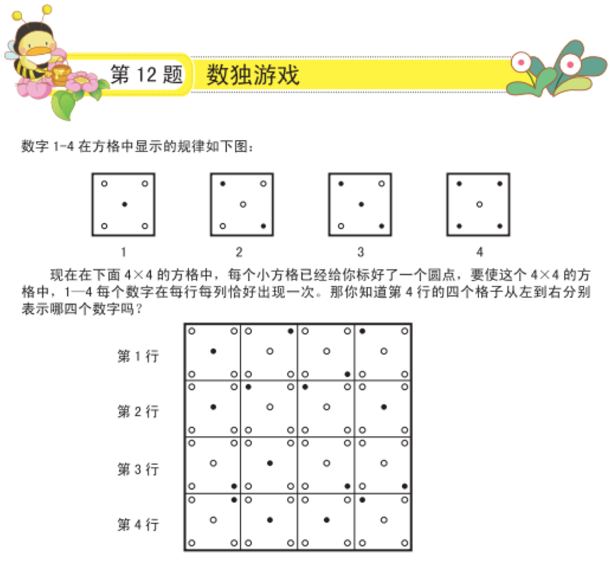

答案:
1 4 2 3
3 2 4 1
2 1 3 4
4 3 1 2

[完整答案](http://nj.aoshu.com/e/20151230/5683989f7b888.shtml)